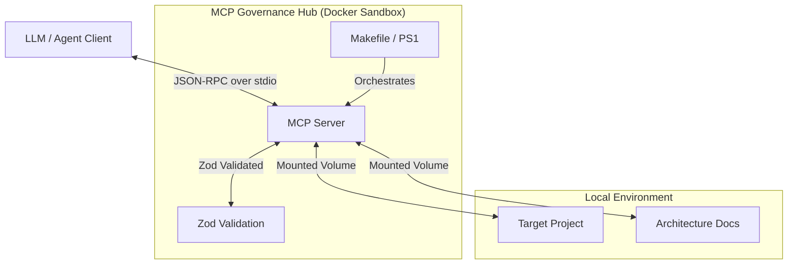

# 🏛️ MCP Governance Hub

> **Professional-grade AI Governance Framework for deterministic, local agentic workflows.**

[](https://opensource.org/licenses/MIT)
[](https://modelcontextprotocol.io)
[](https://www.docker.com/)
[](https://github.com/your-username/mcp-governance-hub/actions/workflows/ci.yml)

---

## ⚡ 60-Second Quickstart

> **No local Node.js or Python required.** Everything runs inside Docker.

1. **Build & Start**:
   ```bash
   # Linux/macOS
   make up

   # Windows
   ./mcp.ps1 up
   ```
2. **Dry Run a Tool Call** (Verify Governance):
   ```bash
   # Linux/macOS
   cat ./test/fixtures/adr-tool-call.json | docker compose run --rm -i mcp-server

   # Windows
   Get-Content ./test/fixtures/adr-tool-call.json | docker compose run --rm -i mcp-server
   ```
3. **Check the Result**: Look at `docs/adrs/` — you just generated a professional, Zod-validated ADR via a sandboxed AI tool!
4. **Scan for vulnerabilities**:
   ```bash
   make analyze-deps
   # Windows: ./mcp.ps1 analyze-deps
   ```

---

## 📖 Design Philosophy

This project is more than just a boilerplate. It advocates for a specific **Governance Architecture** for agentic development.

Imagine a workspace with 3 projects: a **Rust backend**, a **Python data-processor**, and a **TypeScript UI**. Instead of duplicating rules:
1.  Keep a unique `AGENTS.md` in each project for local, language-specific nuances.
2.  The **MCP Governance Hub** serves a centralized `mcp://hub/architecture` resource for global rules.
3.  The agent combines both, using the Hub to coordinate a cross-language feature (e.g. "Update the Rust API and the React Client").
4.  Standardize high-stakes side effects (ADRs, Compliance scans) through the Hub's Zod-validated tools.
5.  Maintain "Passive Memory" (Architecture Docs, Local Rules) in simple Markdown for zero-latency indexing.

*   [**Architecture Deep Dive**](./docs/architecture.md): Learn about the Sandbox boundary and Zod-driven governance.
*   [**Trade-offs & Comparisons**](./docs/trade-offs.md): Why use this instead of pure markdown or cloud platforms?
*   [**The Hybrid Strategy**](./docs/hybrid-strategy.md): Why the best setup uses both MCP and local documentation.

---

## 🏗️ Architecture

The MCP Governance Hub acts as the "API Brain" between your LLM (Claude, GPT-4) and your local project files.



---

## 🛠️ Features

### 1. Polyglot by Design
The Hub is designed to orchestrate projects in **any language**. The workflow prompts and tools focus on architectural patterns that adapt to Rust, Go, Python, or JavaScript environments.

### 2. Sandboxed Execution
By default, the hub runs inside a Node 22 container. Your host machine stays clean.
- **Windows**: `powershell -File ./mcp.ps1 up`
- **Linux/macOS**: `make up`

### 3. Automated Governance (ADRs)
Never manually write another ADR. The hub acts as a **Governance Gatekeeper** by exposing a `create_adr` tool that validates input strictly via **Zod**, ensuring your architecture history is professional and consistent.

### 4. Progressive Context Management
- **Resources**: Expose coding rules and system prompts directly to the LLM.
- **Prompts**: Standardize workflows (e.g., "Scaffold new API endpoint").
- **Tools**: Perform side-effect actions safely.

### 5. Workspace Discovery
Use the `summarize_workspace` tool to orient the AI. It will scan sibling directories and identify their technology stacks (Rust, Go, Python, PHP, etc.) automatically.

---

## 🎮 How to Use the Examples

Once the Hub is connected to your AI Agent (Cursor, Claude, etc.), try typing these exact phrases to see the Governance in action:

- **Orient the Agent**: *"Scan my workspace using the MCP hub and tell me what projects you find."* (Triggers `summarize_workspace`)
- **Scaffold a Feature**: *"I want to add a new [User Login] feature. Use the MCP feature_scaffolding workflow to guide me."* (Triggers `feature_scaffolding` prompt)
- **Generate an ADR**: *"Document our decision to use Redis for caching using the MCP create_adr tool. Use the feature_scaffolding context we just generated to ensure all Zod-required consequences (positive and negative) are included."*
- **Check Compliance**: *"Verify if my latest API file follows our architectural requirements using the MCP hub."* (Triggers `verify_compliance`)

## 🏁 Getting Started

### Prerequisites
- Docker & Docker Compose
- An MCP-compliant client (Cursor, Claude Desktop, Roo Code, etc.)

> No Node.js, Python, or other runtimes needed on the host machine.

### Installation

1. Clone this repo into your projects folder.
2. Build the hub:
   ```bash
   # Linux/macOS
   make build

   # Windows
   ./mcp.ps1 build
   ```
3. Configure your MCP client:

```json
"mcpServers": {
  "mcp-governance-hub": {
    "command": "docker",
    "args": [
      "run", "-i", "--rm",
      "-v", "/absolute/path/to/your/projects:/projects",
      "mcp-governance-hub:latest"
    ]
  }
}
```

> **Note on Volume Mapping**: By default, the Hub mounts the **parent directory** of `mcp-governance-hub` to `/projects`. This allows a single Hub instance to orchestrate and govern multiple **sibling projects** in your workspace simultaneously.

> [!IMPORTANT]
> **Strict Mode vs. Workspace Mode**: While mounting the parent directory (Workspace Mode) is convenient for orchestration, it violates the **Principle of Least Privilege**. For production environments or sensitive tasks, we strongly recommend **Strict Mode**: mount *only* the specific target project directory (`-v /path/to/specific-project:/projects`) to prevent the agent from accessing or modifying sibling repositories.

---

## 🧪 Testing

All tests run inside the Docker container — no local runtime needed.

```bash
# Run unit tests
make test
# Windows: ./mcp.ps1 test

# Run with coverage
make test-coverage
# Windows: ./mcp.ps1 test-coverage

# MCP protocol smoke test
make test-functional
# Windows: ./mcp.ps1 test-functional

# OSV.dev vulnerability scan
make analyze-deps
# Windows: ./mcp.ps1 analyze-deps
```

## 📄 License
MIT © 2026
