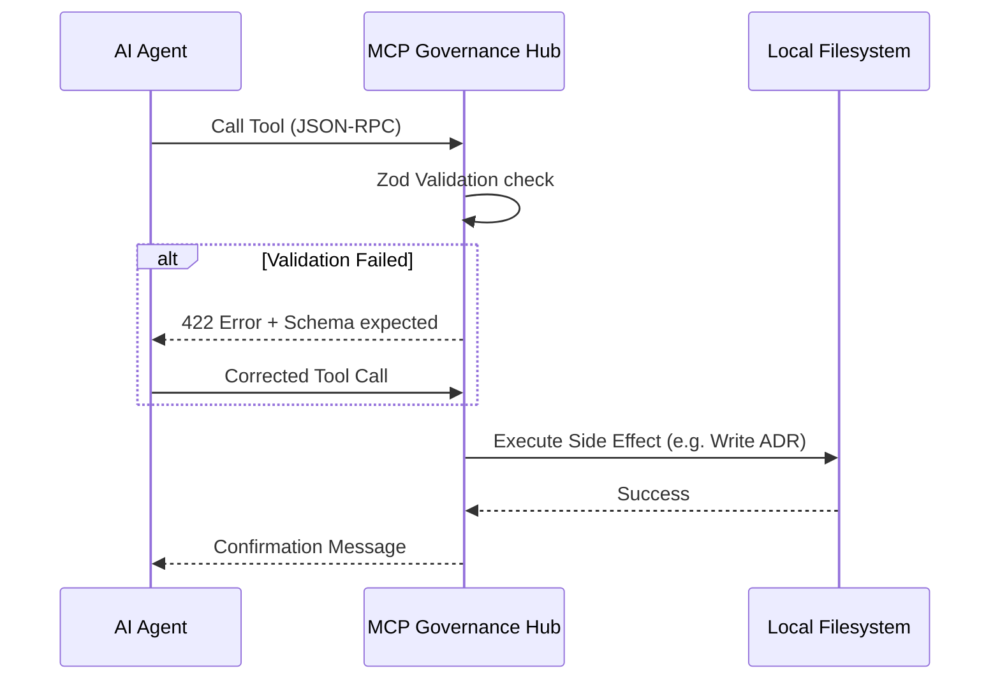

# Architecture: The MCP Governance Hub

This document explains the technical implementation and design philosophy of the **MCP Governance Hub**.

## 1. The Execution Boundary

Traditional agentic setups often give the AI direct access to the terminal and file system. This is high-risk and leads to "environment drift." 

The **MCP Governance Hub** introduces a **Strict Sandbox Boundary**:
- **Isolated Runtime**: The Hub runs in a Docker container with restricted capabilities.
- **Volume Isolation**: Only the `/projects` directory is mounted. The agent cannot see or touch the host's OS configuration, environment variables, or private files outside that scope.

## 2. The Three-Layer Guardrail Architecture

This Hub implements a multi-layered defense-in-depth strategy to ensure agentic safety.

| Layer | Type | Mechanism | Purpose |
| :--- | :--- | :--- | :--- |
| **Layer 1** | Structural | Docker Sandbox | Prevents host-machine tampering and environment drift. |
| **Layer 2** | Input | Zod Schemas | Prevents malformed tool calls and "lazy" AI behavior. |
| **Layer 3** | Output | Compliance Tool | Audits generated code for secrets and architectural leaks. |

## 3. Governance via Zod

The primary differentiator of this hub is **Schema-Driven Tooling**. Every tool exposed to the AI is backed by a Zod schema.

### How it reduces hallucinations:

1.  **Enum Enforcement**: By using `z.enum(["Proposed", "Accepted", ...])`, we stop the AI from inventing its own statuses like "Drafting" or "Thinking."
2.  **Depth Enforcement**: We use `.min(20)` for fields like `context` and `decision`. If the AI tries to hallucinate a lazy one-line decision, the Hub rejects it, forcing the AI to provide actual technical depth.
3.  **Typed Consequences**: We force a structured `consequences` object with both `positive` and `negative` arrays. This ensures the AI considers the "Trade-offs"—a key area where LLMs usually hallucinate "perfect" solutions.

#### Example: Hallucination Defense Schema
```typescript
export const AdrSchema = z.object({
  title: z.string().min(5),
  status: z.enum(["Proposed", "Accepted", "Rejected", "Superseded"]),
  context: z.string().min(20, "Context must explain the problem statement thoroughly"),
  decision: z.string().min(20, "Decision must be technically detailed"),
  consequences: z.object({
    positive: z.array(z.string()).min(1),
    negative: z.array(z.string()).min(1) // Force the AI to admit downsides
  })
});
```

## 4. Automated Auditing
Governance isn't just about writing; it's about checking. The Hub includes a **`verify_compliance`** tool that allows the agent to act as a "Security & Architecture Linter." 
- **Enforcement**: Ensuring all files have proper License headers.
- **Prevention**: Blocking the use of restricted libraries or hardcoded secrets.
- **Validation**: Verifying that domain logic is correctly isolated from the persistence layer.

## 5. Standardized Automation

By providing both a `Makefile` and `mcp.ps1`, we eliminate the "works on my machine" problem.
- **NodeNext/ESM**: We use the latest TypeScript standards for 2026, ensuring high-performance module resolution and compatibility with modern libraries.
- **Vitest**: Testing is not an afterthought. The hub includes a protocol test suite to verify that your tools work exactly as specified before you ever connect an LLM.

## 6. Polyglot Orchestration

While the Hub is built on TypeScript for its robust ecosystem and MCP SDK support, it is functionally agnostic. It treats all projects as generic file systems and JSON-RPC targets. This allows a single Hub to manage the governance and workflows for polyglot microservices (e.g. Rust, Go, Python, Node) simultaneously without context contamination.

## 7. The Safe Native Handshake (JS vs. Shell)

A key hardening decision in this Hub is the complete avoidance of shell-based execution (e.g., `child_process.exec`). 

| Feature | Shell Execution (`ls`, `dir`, `rm`) | Native JS Handshake (`fs.readdir`, etc.) |
| :--- | :--- | :--- |
| **Security** | Vulnerable to **Command Injection**. | **Immune**. Uses typed system calls. |
| **Portability** | OS-Specific (fails on cross-platform). | **Universal**. Identical on Windows/Linux. |
| **Context** | Raw text output (needs parsing). | **Structured**. Enriched metadata for the AI. |
| **Safety** | High risk of unintended side-effects. | **Controlled**. Logic-gated filesystem access. |

By using native Node.js APIs, the Hub ensures that the agent's actions are **Deterministic** and **Hardened** against malicious or hallucinated input.

## 8. Creation vs. Governance: The Intelligent Handshake

A critical distinction of this framework is the separation of **Creativity** and **Structure**.

1.  **The LLM (Creation)**: The LLM is responsible for the "Thinking." It analyzes the code and generates the raw architectural decision data.
2.  **The Hub (Governance)**: The Hub is responsible for the "Enforcement." It validates the LLM's data against Zod schemas and applies a standardized Markdown template.

This ensures that your architecture remains consistent regardless of which model (Claude, GPT, Gemini) is being used. The AI provides the "Intelligence," while the Hub provides the "Discipline."


