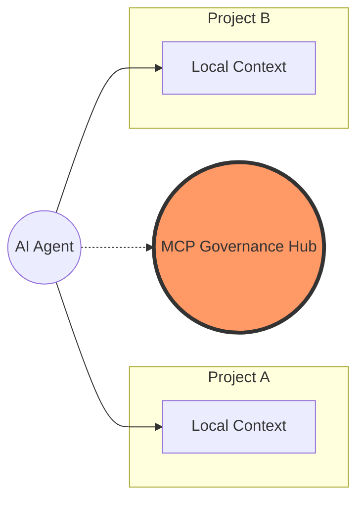

# The Hybrid Context Strategy (MCP Governance)

A common mistake in agentic AI is trying to move **everything** into MCP. The **MCP Governance Hub** advocates for a **Hybrid Approach**.

## 1. The "Passive Memory" vs. "Active Execution" Boundary

The **MCP Governance Hub** advocates for a strict boundary between what the AI "knows" (Context) and what it "does" (Execution):

### Use Local Markdown (.md / .cursorrules) for Passive Memory:
- **Sync with Code**: Knowledge that must change *with* your git commits (e.g., Domain Types, Local Style).
- **Project-Specific Rules**: "In this repository, we use specific naming conventions for our data models."
- **Low Latency**: Context that the AI needs to "know" instantly without a network/docker handshake.

### Use the MCP Hub for Active Execution:
- **Workflows & Skills**: Multi-step prompts that should be centralized to prevent "workflow drift."
- **Side-Effect Tools**: Actions that require validation (ADRs, Ticket creation, Deployments).
- **Governance**: Cross-project rules that are enforced via Zod schemas rather than just "suggested" in text.

## 2. Why Hybrid is Best

1.  **Latency Optimization**: LLMs can read local files instantly. MCP calls, while fast, involve JSON-RPC overhead and Docker context switching.
2.  **The "Bus Factor"**: If the Hub is down, the project should still have enough local markdown context to remain somewhat understandable by the AI.
3.  **The MCP Signpost**: We use a standardized `AGENTS.md` file in the root of every project to direct the AI to the Hub. This prevents the AI from "getting lost" or hallucinating local scripts.

## 3. "God-Mode" Agents vs. "Bound" Agents

Not all AI clients interact with the Hub the same way. It is crucial to understand the difference in your workforce:

- **Bound Agents (Cursor, Roo Code, Claude Desktop):** These agents operate in strict, sandboxed environments. They *must* connect to the Governance Hub via the official MCP JSON-RPC protocol. The Hub acts as their API gateway to execute scripts (like `analyze_dependencies`) safely.
- **God-Mode Agents (Antigravity):** These agents have native, unrestricted access to the host machine's terminal and filesystem. They do not rely on the JSON-RPC layer. Instead, they interact with the Hub natively—they directly execute the `mcp.ps1` scripts and read the `prompts/` markdown files. 

For God-Mode agents, the Hub functions as a **Canonical Rulebook & Automation Toolbelt** rather than an API. Because the governance rules and scripts are centralized, both paradigms (Bound and God-Mode) remain fully synchronized and deterministic.

## 4. How the Agent Sees This (The Logic Flow)

Whether you are working in **PHP (Laravel)**, **Rust (Axum)**, or **JS (Next.js)**, the AI agent follows this mental model:

1.  **Project Entry**: The AI reads `AGENTS.md`. It learns: *"Okay, this is a PHP project, use PSR-12, but I must use the 'MCP Governance Hub' for ADRs."*
2.  **Context Loading**: It fetches `mcp://hub/architecture`. It learns: *"Global rule: All API changes require an ADR."*
3.  **Task Execution**: User says 'Add a login endpoint.' 
4.  **Hybrid Reasoning**: 
    - *Agent thinks:* "I'll use the Hub's `feature_scaffolding` workflow to plan."
    - *Agent thinks:* "I'll use the local PHP context to write the code."
    - *Agent thinks:* "I'll use the Hub's `create_adr` tool to finalize the design."

## 4. Implementation Example

Imagine a workspace with 3 projects: a **Rust backend**, a **Python data-processor**, and a **TypeScript UI**. Instead of duplicating rules:
1.  Keep a unique `AGENTS.md` in each project for local, language-specific nuances.
2.  The **MCP Governance Hub** serves a centralized `mcp://hub/architecture` resource.
3.  The agent combines both, using the Hub to coordinate cross-language features (e.g. "Update the Rust API and the React Client").

